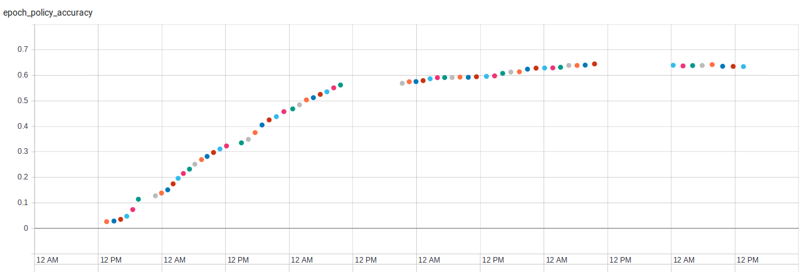
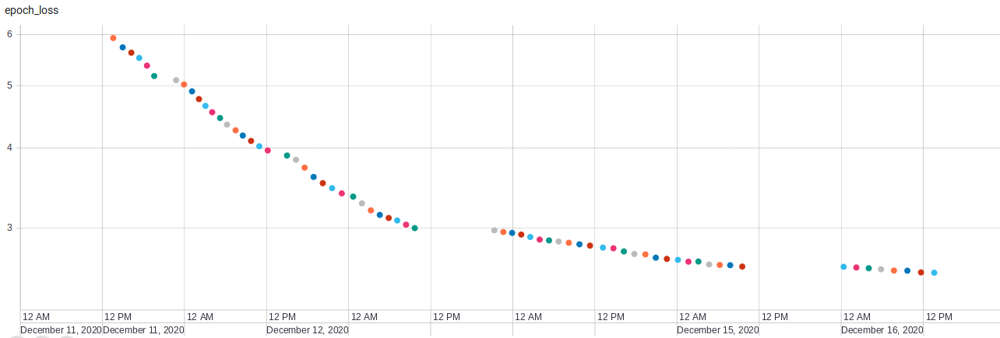
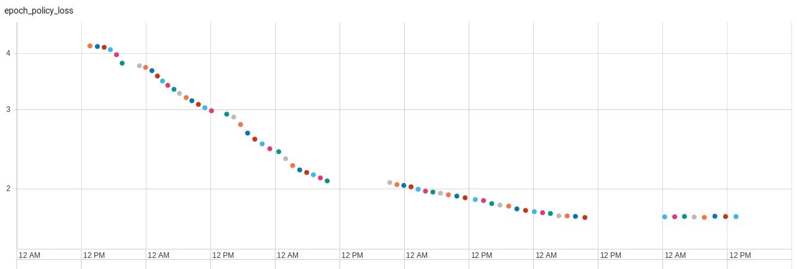
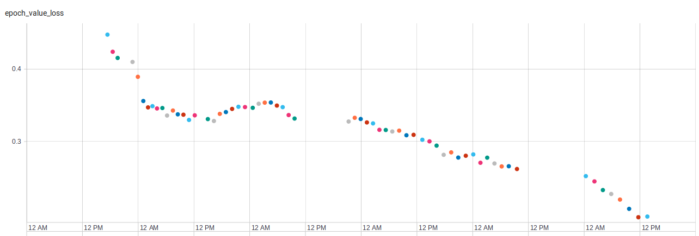
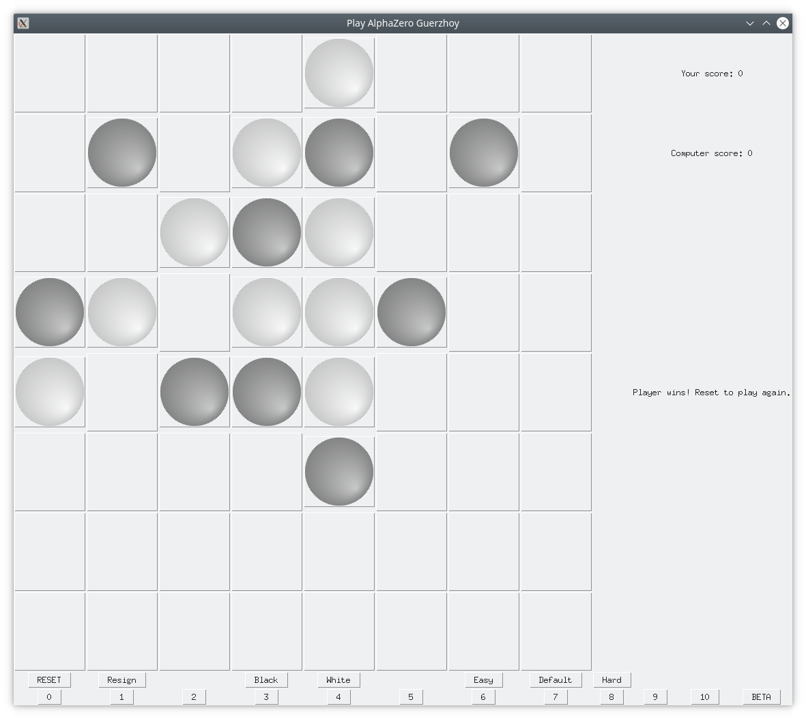

# alphazero-guerzhoy

IN PROGRESS

Mastering gomoku using the General Reinforcement Learning Algorithm from DeepMind in the paper published here: https://arxiv.org/pdf/1712.01815.pdf, https://doi.org/10.1038/nature24270. Entry to the ESC180 gomoku class contest for Gomoku after project 2 (basic computer player based on rule based system).

Note: gomoku.py is redacted and will be released at a later time. However, no other file depends on that file.

Completed:  
Game  
Optimize game  
Write neural network  
Write Monte-Carlo Tree Search(MCTS) Algorithm  
Debug (This took way too long lmao)  

TODO:  
Train network (In Progress ~13000 games: I think the agent just learned what a draw is.)  
MORE BUGS :(  
Win!  

Current Progress:  

67 batches of training consisting of 200 games each have been done. 

The accuracy of the policy prediction is given:  
  

The losses for the training (P+V), policy and value components are shown below:  
  
  
  

There are still some issues of the A.I. losing some games for simple reasons during play. An example is here. These issues are likely able to be resolved with more training.  

